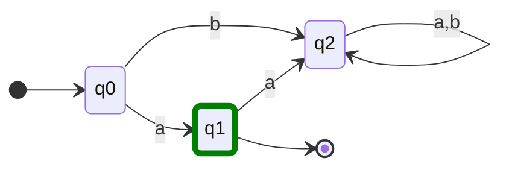

# definicion
$$
(\Sigma, \mathcal{Q}, q_0, F, \Gamma)
$$
$$
\begin{array} \\
\Sigma: \mbox{ conjunto finito (alfabeto)} \\
\mathbf{Q}: \mbox{ conjunto de estados } \\
q_0 \in \mathbf{Q}, q_0 \mbox{ estado inicial } \\
F \subset \mathbf{Q}: F\mbox{ conjunto de estados finales } \\
\Gamma: \mbox{ funcion de transicion }\\
\Gamma: \Sigma \times \mathbf{Q} \to \mathbf{Q} 
\end{array}
$$
Una automata es *determinista* si para cada estado existe una transición para cada letra del alfabeto, y solo 1 transicion por cada una. (puede no pasar para la transición final?)

El estado inicial se marca con una flecha que sale de la nada hacia el estado, y el estado final se marca con un doble circulo.

![[Automatas Finitos Deterministicos 2023-09-19 18.37.56.excalidraw]]

son la misma automata.
# Lenguaje
Se define el *lenguaje* $L$ de una automata como *"todas las cadenas compuestas por elementos del alfabeto que son aceptadas por la autómata"*.
$$
\begin{align}
&\Sigma = \{ a,b \} \\
&\Sigma^{*} = \mbox{ todas las cadenas de } \Sigma \\
&L = \{ x \in \Sigma^{*} : x\mbox{ es aceptada } \}
\end{align}
$$

$\Sigma^{*}$ representa todas las posibles cadenas compuestas por $a,b$ de todas las longitudes, incluido el vacío: $\lambda$

## función de transición generalizada

la función de transición generalizada
$$
\Gamma^{*} : \mathbf{}{Q}\times\Sigma^{*} \to \mathbf{}{Q}
$$

define si la automata acepta palabras. Si existe una función de transición generalizada que te lleve del estado inicial a uno de los estados finales, entonces la automata acepta (algunas) palabras.

## Expresiones Regulares
las autómatas pueden expresarse como expresiones regulares. La conjunción significa concatenación y la disyunción significa posibles opciones. Un exponente indica cuantas veces se concatena esa cadena, usando el asterisco \* para indicar 0 o muchas. Deben llegar a un estado final. O sea, describen todas las palabras que son aceptadas por el automata.

Por ejemplo, la ER de la automata [[Automatas Finitos Deterministicos 2023-09-19 18.37.56.excalidraw|arriba]] es $a$ [^1]

[^1]: creo? No se si esa ER esta bien para esa automata.

