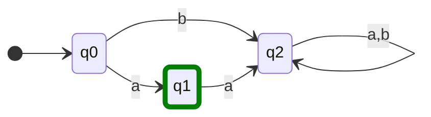

# definición
Una *autómata finita* $M$ esta determinada por 5 partes:
1. un conjunto finito de letras (el alfabeto): $\Sigma$
2. un conjunto finito de de estados (internos): $\mathbf{Q}$
3. un subconjunto de $\mathbf{Q}$ de estados finales: $F$
4. un estado inicial, perteneciente a $\mathbf{Q}$: $q_{0}$
5. una función de $\Sigma \times \mathbf{Q}$ en $\mathbf{Q}$ que genera el "estado siguiente": $\Gamma$

$$
M = (\Sigma, \mathbf{Q}, q_0, F, \Gamma)
$$
$$
\begin{array} \\
\Sigma: \mbox{ conjunto finito (alfabeto)} \\
\mathbf{Q}: \mbox{ conjunto de estados } \\
q_0 \in \mathbf{Q}, q_0 \mbox{ estado inicial } \\
F \subset \mathbf{Q}: F\mbox{ conjunto de estados finales } \\
\Gamma: \mbox{ funcion de transicion }\\
\Gamma: \Sigma \times \mathbf{Q} \to \mathbf{Q} 
\end{array}
$$
Una autómata es *determinista* si para cada estado existe una sola transición para cada letra del alfabeto, y solo 1 transición por cada una. (puede no pasar para la transición final?)

El estado inicial se marca con una flecha que sale de la nada hacia el estado, y el estado final se marca con un doble circulo.

![[Automatas Finitos Deterministicos 2023-09-19 18.37.56.excalidraw]]

son la misma autómata.
# Lenguaje
Un *Lenguaje* es un conjunto de palabras o cadenas del alfabeto $\Sigma$.
Se define el *lenguaje $L$ de una autómata* o bien *Lenguaje reconocido por una autómata* como *"todas las cadenas compuestas por elementos del alfabeto que son aceptadas por la autómata"*.
$$
\begin{align}
&\Sigma = \{ a,b \} \\
&\Sigma^{*} = \mbox{ todas las cadenas de } \Sigma \\
&L = \{ x \in \Sigma^{*} : x\mbox{ es aceptada } \}
\end{align}
$$

$\Sigma^{*}$ representa todas las posibles cadenas compuestas por $a,b$ de todas las longitudes, incluido el vacío: $\lambda$

## función de transición generalizada

la función de transición generalizada
$$
\Gamma^{*} : \mathbf{}{Q}\times\Sigma^{*} \to \mathbf{}{Q}
$$

define si la autómata acepta palabras. Si existe una función de transición generalizada que te lleve del estado inicial a uno de los estados finales, entonces la autómata acepta (algunas) palabras.

con esta función de transición generalizada, podemos definir al Lenguaje de la autómata como
$$
L = \{ x \in \Sigma^{*} | \ \Gamma^{*}(x, q_{0}) \in F\}
$$

## Expresiones Regulares
las autómatas pueden expresarse como expresiones regulares. La conjunción significa concatenación y la disyunción significa posibles opciones. Un exponente indica cuantas veces se concatena esa cadena, usando el asterisco \* para indicar 0 o muchas. Deben llegar a un estado final. O sea, describen todas las palabras que son aceptadas por el autómata.

Por ejemplo, la ER de la autómata [[Automatas Finitos Deterministicos 2023-09-19 18.37.56.excalidraw|arriba]] es $a$ [^1]

[^1]: creo? No se si esa ER esta bien para esa autómata.

## Autómata Determinístico Minimo
Es una autómata que acepta las mismas palabras que otro dado (y algo sobre ser minimo?)

**Como encontrarlo:**
En base a como se comportan los distintos estados de la autómata bajo las letras del alfabeto (transiciones), podemos determinar las [[Relaciones#^359539|clases]] de cada estado.

### Procedimiento
Dado el conjunto de estados $\mathbf{Q}$, lo separamos en 2 conjuntos: un conjunto con los estados finales y otro con los estados no finales.

Luego, armamos la tabla de la funcion de transicion para la automata y vemos como se comporta cada estado para las distintas transiciones.

Si para 2 estados de la misma clase (los subconjuntos que armamos sobre $\mathbf{Q}$) no se comportan de la misma manera para cada transicion, entonces debemos separarlos en clases distintas. Decimos que se comportan de la misma manera si bajo la transicion dada, los estados van a parar a estados de la misma clase (aunque los estados puntuales a los que van a parar sean distintos).

Seguimos separando hasta que ya no podemos.