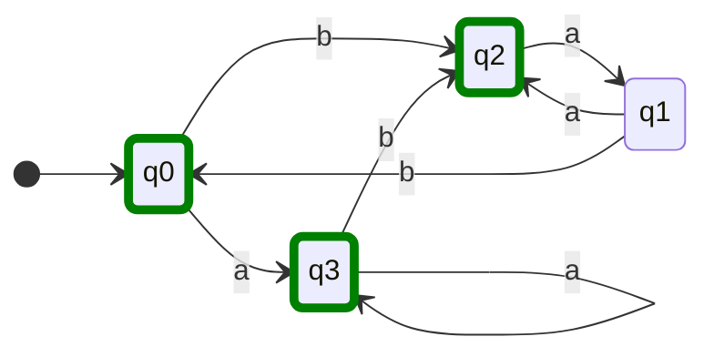

## maquina M4

estados finales: $\{ q0, q1, q3 \}$
estados no finales: $\{ q1 \}$


| Y   | a     | b     |
| --- | ----- | ----- |
| q0  | \[q0] | \[q0] |
| q1  | \[q0] | \[q0] |
| q2  | \[q1] | \[q1] |
| q3  | \[q0] | \[q0] | 
entonces vemos que del conjunto de estados finales, algunos van a parar a otra clase (q2). Asi que separamos de nuevo:
$$
\begin{split}
[q1] &= \{ q1 \} \\
[q0] &= \{ q0, q3 \} \\
[q2] &= \{ q2 \}
\end{split}
$$

| Y   | a     | b     |
| --- | ----- | ----- |
| q0  | \[q0] | \[q2] |
| q1  | \[q2] | \[q0] |
| q2  | \[q1] | \[q1] |
| q3  | \[q0] | \[q2] | 

q1 y q2 estan solos en sus clases ppr lo que no se van a partir. Las filas de q0 y q3 son iguales, por lo que la clase de q0 tampoco se vuelve a partir.

### Lenguaje
$$
L = \left\{  w \in \sum / w = \underbrace{ a^{n}b(a^{m}b^{p})^{k} }_{ j } \cdot bj^{h} / n \geq 0, m \geq 1, p \geq 1, k \geq 0, h \geq 1  \right\}
$$


## maquina M5
```mermaid
stateDiagram
	classDef End stroke-width:5px,stroke:green
    

	class q1 End
```

| Y   | a   | b   |
| --- | --- | --- |
| q0  | q3  | q1  |
| q1  | q2  | q4  |
| q2  | q5  | q0  |
| q3  | q0  | q4  |
| q4  | q5  | q1  |
| q5  | q2  | q3  | 


